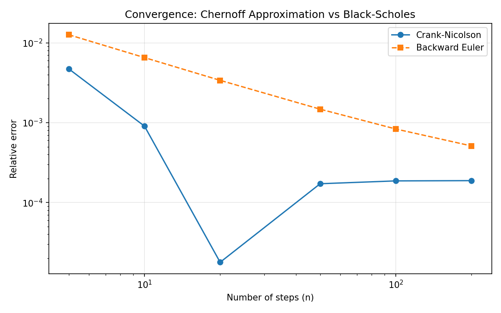

# ChernoffPy

[](https://github.com/sergeeey/MarkovChains/actions/workflows/tests.yml)

Option pricing through the heat equation with mathematically tracked numerical error.

ChernoffPy prices European options, barrier options, and local-volatility options by solving transformed Black-Scholes PDEs with Chernoff semigroup approximations.  
Each pricing run includes an accuracy certificate with error decomposition.

<p align="center">
  
</p>

## Why ChernoffPy?

| Feature | ChernoffPy | QuantLib | Typical BS libs |
|---|---|---|---|
| Certified error decomposition | ✅ | ❌ | ❌ |
| Chernoff semigroup method | ✅ | ❌ | ❌ |
| Barrier options (8 types) | ✅ | ✅ | ❌ |
| Local volatility `sigma(S,t)` | ✅ | ✅ | ❌ |
| Implied volatility | ✅ | ✅ | ✅ |
| Core dependencies | `numpy`, `scipy` | C++ + SWIG | Varies |

## Quick Start

### European option

```python
from chernoffpy import CrankNicolson
from chernoffpy.finance import EuropeanPricer, MarketParams, bs_exact_price

market = MarketParams(S=100, K=105, T=1.0, r=0.05, sigma=0.20)
pricer = EuropeanPricer(CrankNicolson())

result = pricer.price(market, n_steps=50, option_type="call")
bs = bs_exact_price(market, "call")

print(f"Chernoff: {result.price:.4f}")
print(f"BS exact: {bs:.4f}")
print(f"Error:    {abs(result.price - bs)/bs:.4%}")
```

### Certified accuracy

```python
cert = result.certificate
print(f"Chernoff error: {cert.chernoff_error:.2e}")
print(f"Domain error:   {cert.domain_error:.2e}")
print(f"Total error:    {cert.abs_error:.2e}")
```

### Barrier options

```python
from chernoffpy import CrankNicolson
from chernoffpy.finance import BarrierPricer, BarrierParams, MarketParams

barrier = BarrierParams(barrier=90, barrier_type="down_and_out")
b_pricer = BarrierPricer(CrankNicolson())
market = MarketParams(S=100, K=100, T=1.0, r=0.05, sigma=0.20)

result = b_pricer.price(market, barrier, n_steps=50, option_type="call")
print(f"Down-and-Out Call: {result.price:.4f}")
print(f"Vanilla Call:      {result.vanilla_price:.4f}")
```

Supported barrier families: `down/up x in/out x call/put`.

### Local volatility

```python
from chernoffpy import CrankNicolson
from chernoffpy.finance import LocalVolPricer, LocalVolParams, linear_skew

vol_surface = linear_skew(sigma_atm=0.20, skew=0.05, S_ref=100)
params = LocalVolParams(S=100, K=100, T=1.0, r=0.05, vol_surface=vol_surface)

pricer = LocalVolPricer(CrankNicolson())
result = pricer.price(params, n_steps=100, option_type="call")
print(f"Local vol price: {result.price:.4f}")
```

### Implied volatility

```python
from chernoffpy.finance import implied_volatility

sigma = implied_volatility(market_price=8.02, S=100, K=105, T=1.0, r=0.05)
print(f"Implied vol: {sigma:.4f}")
```

### Greeks

```python
from chernoffpy.finance import compute_greeks

greeks = compute_greeks(pricer, market, n_steps=50, option_type="call")
print(f"Delta: {greeks.delta:.4f}")
print(f"Gamma: {greeks.gamma:.6f}")
print(f"Vega:  {greeks.vega:.4f}")
print(f"Theta: {greeks.theta:.4f}")
print(f"Rho:   {greeks.rho:.4f}")
```

## How It Works

Black-Scholes PDE is transformed (Wilmott substitution) to a heat-equation form on log-price space.  
ChernoffPy then approximates the heat semigroup with product formulas:

- Backward Euler style: first-order behavior in `1/n`
- Crank-Nicolson style: second-order behavior in `1/n^2`

For barrier options, a Dirichlet projection is enforced after each Chernoff step.  
For local volatility, a frozen-coefficient predictor-corrector scheme updates effective sigma over time.

## Architecture

```text
chernoffpy/
├── functions.py           # Chernoff functions: BackwardEuler, CrankNicolson, Padé
├── analysis.py            # Convergence analysis tools
│
└── finance/
    ├── validation.py          # MarketParams, GridConfig, BarrierParams, certificates
    ├── transforms.py          # Wilmott substitution BS <-> Heat equation
    ├── european.py            # EuropeanPricer
    ├── greeks.py              # Delta, Gamma, Vega, Theta, Rho
    ├── barrier.py             # BarrierPricer (8 types)
    ├── barrier_analytical.py  # Reiner-Rubinstein formulas (test reference)
    ├── local_vol.py           # LocalVolPricer
    ├── implied_vol.py         # price -> sigma
    ├── reporting.py           # Human-readable reports
    └── __init__.py            # Public API

examples/
└── finance_demo.ipynb
```

## Accuracy Snapshot

| Configuration | Typical error |
|---|---|
| European ATM, Crank-Nicolson, `n=50` | ~0.015% |
| European ATM, Backward Euler, `n=50` | ~1% |
| Barrier DOC ATM, Crank-Nicolson | typically within a few % (barrier discretization dependent) |
| Barrier far from spot | close to vanilla price |
| Local vol (flat sigma) vs European | very small mismatch |
| Implied-vol roundtrip | near machine precision in tests |

## Tests

```bash
pytest tests/ -q
# 215 passed
```

## Installation

```bash
git clone https://github.com/sergeeey/MarkovChains.git
cd MarkovChains
pip install -e .
```

Requirements: Python 3.10+, NumPy, SciPy.

## References

- Chernoff, P.R. (1968). Note on product formulas for operator semigroups.
- Galkin, O. & Remizov, I. (2025). Convergence rates for Chernoff-type approximations.
- Reiner, E. & Rubinstein, M. (1991). Breaking down the barriers.
- Dupire, B. (1994). Pricing with a Smile.
- Black, F. & Scholes, M. (1973). The pricing of options and corporate liabilities.

## License

MIT. See `LICENSE`.
