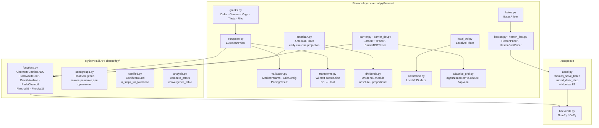

# Архитектурный документ: ChernoffPy

**Тип документа:** Architecture Overview
**Проект:** ChernoffPy v0.1.0
**Тип системы:** Numerical Computing Library (Python)
**Окружение:** Production (PyPI-ready, MIT License)
**Аудитория:** разработчики библиотеки, квантовые аналитики, исследователи в области численных методов
**Дата:** 2026-02-27
**Источник:** кодовая база `chernoffpy/` (~5 400 строк), `pyproject.toml`, `.github/workflows/ci.yml`

---

## Содержание

1. [Назначение системы](#назначение-системы)
2. [Компонентная архитектура](#компонентная-архитектура)
3. [Математическое ядро](#математическое-ядро)
4. [Поток данных при ценообразовании](#поток-данных-при-ценообразовании)
5. [Зависимости и окружение](#зависимости-и-окружение)
6. [Бэкенды и ускорение](#бэкенды-и-ускорение)
7. [Ключевые архитектурные решения](#ключевые-архитектурные-решения)
8. [CI/CD и качество](#cicd-и-качество)
9. [Ограничения системы](#ограничения-системы)
10. [⚠️ Пробелы и TODO](#пробелы-и-todo)

---

## Назначение системы

ChernoffPy — первая open-source реализация метода оператор-полугрупп Чернова применительно к ценообразованию финансовых производных.

**Что делает система:**

- Решает уравнение Блэка-Шоулза и его обобщения (Heston, Bates, local vol) через итеративное применение оператора Чернова вместо прямого интегрирования PDE
- Возвращает гарантированную верхнюю границу ошибки вместе с ценой — `CertifiedBound`
- Поддерживает европейские, барьерные, американские опционы с единым интерфейсом

**Что система не делает:**

- Не является торговой системой или API-сервисом
- Не реализует получение рыночных данных
- Не управляет портфелем

---

## Компонентная архитектура



### Слои и правило зависимостей

```
chernoffpy/            ← математическое ядро (operators, semigroups, bounds)
    └── finance/       ← финансовые приложения (pricers, calibration, greeks)
```

**Инвариант:** `finance/` импортирует из `chernoffpy/`, обратное запрещено. Нарушение этого правила разрушит возможность использовать ядро без финансовой надстройки.

---

## Математическое ядро

### Формула произведений Чернова

Для оператора `L` (генератора полугруппы) и оператор-значной функции `F(t)`:

$$e^{tL}f = \lim_{n \to \infty} F\!\left(\frac{t}{n}\right)^n f$$

Условия на `F`: `F(0) = I`, `‖F(t)‖ ≤ 1` (сжатие), `F'(0) = L`.

По теореме Галкина-Ремизова (Israel J. Math., 2025): если `F` совпадает с `e^{tL}` по первым `k` производным при `t = 0`, то скорость сходимости — `O(1/nᵏ)`.

### Реализованные схемы Чернова

| Класс | Порядок k | Мультипликатор Фурье | Стабильность |
|---|---|---|---|
| `BackwardEuler` | 1 | `1/(1 + tξ²)` | безусловно устойчива |
| `CrankNicolson` | 2 | `(1 - tξ²/2)/(1 + tξ²/2)` | безусловно устойчива |
| `PadeChernoff[p,q]` | `p+q` (типично 3–6) | Padé-аппроксимант `e^z` | A-устойчива при `q ≥ p` |
| `PhysicalG` | 1 | взвешенное среднее со сдвигами `±2√t` | устойчива |
| `PhysicalS` | 2 | взвешенное среднее со сдвигами `±√(6t)` | устойчива |

!!! warning
    `PadeChernoff` с `m > n` (числитель выше знаменателя) генерирует `UserWarning`: схема не A-устойчива, усиливает высокие частоты.

### Подстановка Уилмотта

Перевод уравнения Блэка-Шоулза в уравнение теплопроводности:

```
x = ln(S/K)                  # логарифм спот/страйк
τ = σ² · T / 2               # масштабированное время
k = 2(r-q) / σ²             # безразмерная ставка
α = -(k-1)/2,  β = -(k+1)²/4

V(S,t) = K · exp(α·x + β·τ) · u(x, τ)
```

После подстановки: `∂u/∂τ = ∂²u/∂x²` — стандартное уравнение теплопроводности.

Реализовано в `finance/transforms.py`: `compute_transform_params()`, `bs_to_heat_initial()`, `extract_price_at_spot()`.

### Сертифицированные границы ошибки

`certified.py` реализует верхнюю оценку ошибки на основе теоремы Галкина-Ремизова:

```python
bound: CertifiedBound = compute_certified_bound(
    chernoff=CrankNicolson(),
    market=market,
    n_steps=50,
    payoff_regularity=PayoffRegularity.LIPSCHITZ,
)
# bound.upper_bound — гарантированная граница в единицах цены
# bound.is_tight — True если оценка считается практически точной
```

Регулярность выплаты влияет на константу в оценке:

- `SMOOTH` → наименьшая константа
- `LIPSCHITZ` → стандартный ванильный опцион
- `DISCONTINUOUS` → бинарные/барьерные опционы

---

## Поток данных при ценообразовании

На примере `EuropeanPricer.price()`:

```
MarketParams(S, K, T, r, sigma)
        │
        ▼
  GridConfig → make_grid(config) → x_grid [N точек]
        │
        ▼
  compute_transform_params(market)
  → k, α, β, τ_eff
        │
        ▼
  bs_to_heat_initial(x_grid, market, config, option_type)
  → u0 [начальное условие в пространстве теплопроводности]
        │
        ▼
  ChernoffFunction.compose(u0, x_grid, τ_eff, n_steps)
  = C(τ/n)^n u0  — n итераций оператора C
  → u_final
        │
        ▼
  extract_price_at_spot(u_final, x_grid, market)
  → price (скаляр)
        │
        ▼
  PricingResult(price, certified_bound, bs_exact, fft_price, ...)
```

Для **барьерных опционов** (`BarrierDSTPricer`) добавляется шаг проецирования: после каждого применения `C(τ/n)` значения за барьером обнуляются. Это реализует граничное условие через проекцию, а не через изменение сетки.

Для **американских опционов** (`AmericanPricer`) добавляется `max(u, payoff_intrinsic)` после каждого шага — проекция на множество допустимых значений раннего исполнения.

---

## Зависимости и окружение

### Обязательные зависимости

| Пакет | Версия | Использование |
|---|---|---|
| `numpy` | ≥ 1.24 | все численные операции, FFT, трёхдиагональные системы |
| `scipy` | ≥ 1.10 | `scipy.stats.norm` для BS-формулы, `scipy.optimize` для калибровки |

### Опциональные расширения

| Extra | Пакеты | Эффект |
|---|---|---|
| `fast` | `numba ≥ 0.57` | JIT-компиляция `thomas_solve_batch` и `mixed_deriv_step` — ускорение Heston |
| `gpu` | `cupy-cuda12x ≥ 12.0` | GPU-бэкенд через `get_backend("cupy")` |
| `dev` | `pytest ≥ 7.0`, `pytest-cov ≥ 4.0` | тесты и покрытие |
| `docs` | `mkdocs ≥ 1.5`, `mkdocs-material ≥ 9.0`, `mkdocstrings[python] ≥ 0.24` | сборка документационного сайта |

### Требования к Python

`requires-python = ">=3.10"`. CI тестирует 3.10, 3.11, 3.12, 3.13 на Ubuntu и Windows.

---

## Бэкенды и ускорение

### Архитектура бэкенда (`backends.py`)

```python
xp = get_backend("numpy")   # или "cupy"
arr = to_backend(data, xp)  # конвертация в целевой бэкенд
result = to_numpy(arr)      # обратно в NumPy
```

Переключение бэкенда не затрагивает код пользователя — все операции проходят через `xp.*`.

### Numba JIT (`accel.py`)

Два критических ядра ускоряются через `@njit(parallel=True)` при наличии Numba:

| Функция | Назначение | Где используется |
|---|---|---|
| `thomas_solve_batch()` | Трёхдиагональные системы для v-шагов | `HestonFastPricer`, `BatesPricer` |
| `mixed_deriv_step()` | Смешанная производная `∂²V/∂S∂v` | `HestonPricer` |

При отсутствии Numba — автоматический fallback на NumPy-реализацию. `HAS_NUMBA` и `HAS_CUPY` — публичные флаги для проверки среды.

---

## Ключевые архитектурные решения

### ADR-01: ChernoffFunction как ABC, не функция

**Решение:** оператор Чернова — абстрактный класс с методом `apply()`, а не lambda или callable.

**Причина:** позволяет хранить состояние схемы (порядок, параметры Padé), передавать в `certified.py` для автовыбора константы, использовать в рефлексии (`chernoff.order`, `chernoff.name`).

**Альтернатива:** словарь `{"order": 2, "fn": lambda f, x, t: ...}` — отброшена из-за потери типобезопасности.

---

### ADR-02: DST вместо FFT для барьерных опционов

**Решение:** `BarrierDSTPricer` использует дискретное синусное преобразование (DST-I); `BarrierFFTPricer` — стандартное FFT.

**Причина:** FFT предполагает периодические граничные условия → эффект Гиббса у барьера. DST-I ортогонален к нулевым граничным условиям → нет осцилляций, нет Гиббса, точнее для барьерных опционов.

**Цена:** DST медленнее FFT примерно в 1.5–2x. Компромисс обоснован для точности вблизи барьера.

---

### ADR-03: Подстановка Уилмотта как явный шаг

**Решение:** `transforms.py` — отдельный модуль, видимый пользователю и тестируемый независимо.

**Причина:** подстановка — источник большинства числовых ошибок (переполнение `exp`, некорректный выбор `α`). Явный модуль позволяет тестировать только трансформацию без всего пайплайна и заменять её при необходимости.

---

### ADR-04: Сертифицированная граница как часть публичного API

**Решение:** `PricingResult` всегда содержит `ValidationCertificate`; `compute_certified_bound()` доступна напрямую.

**Причина:** основное научное достижение библиотеки — гарантированная ошибка. Скрывать её во внутренней реализации означало бы потерять главное преимущество перед Monte Carlo и конечными разностями.

---

### ADR-05: Раннее исполнение через проекцию, не через сетку

**Решение:** `AmericanPricer` применяет `u = max(u, intrinsic_payoff)` после каждого шага Чернова.

**Причина:** изменение сетки при каждом шаге (как в классических ADI-методах) несовместимо с формулой `C(t/n)^n` — операторы должны действовать на одном и том же пространстве. Проекция сохраняет пространство неизменным.

---

## CI/CD и качество

### Pipeline (`.github/workflows/ci.yml`)

```
push/PR to main
    │
    ├── job: test (параллельно, 8 комбинаций)
    │   ├── ubuntu-latest × Python 3.10, 3.11, 3.12, 3.13
    │   └── windows-latest × Python 3.10, 3.11, 3.12, 3.13
    │   └── pytest --cov=chernoffpy --cov-fail-under=80
    │
    ├── job: test-numba (ubuntu, Python 3.11)
    │   └── pip install -e ".[fast,dev]"
    │   └── pytest (проверка Numba-пути)
    │
    ├── job: docs (только push в main, after test)
    │   └── pip install -e ".[docs]"
    │   └── mkdocs gh-deploy --force → gh-pages branch
    │
    └── job: publish (только теги v*.*.*, after test)
        └── python -m build
        └── pypa/gh-action-pypi-publish (OIDC Trusted Publisher)
```

### Метрики качества (подтверждённые)

| Метрика | Значение |
|---|---|
| Тесты | 539 pass, 0 fail |
| Покрытие | ≥ 80% (gate в CI) |
| Платформы | Linux, Windows |
| Python | 3.10 – 3.13 |
| Время suite | ~173 секунды (full matrix) |

---

## Ограничения системы

| Ограничение | Детали |
|---|---|
| **Граничные условия** | Только нулевые (Dirichlet) через DST или периодические через FFT. Неограниченная область (Neumann) не реализована |
| **Американский колл + абсолютные дивиденды** | Даёт некорректные цены (~$148 вместо ~$9). Использовать только пропорциональные дивиденды. При передаче абсолютных дивидендов с `option_type="call"` выбрасывается `UserWarning` |
| **Padé с m > n** | Не A-устойчив, вызывает расхождение на высоких частотах. Защита через `UserWarning`, не через `ValueError` |
| **Многоактивные опционы** | Не реализованы (basket, spread) |
| **Дискретное время** | Нет опционов с дискретным мониторингом барьера |
| **GPU-путь** | `backends.py` существует, но Finance-слой не адаптирован под CuPy (Heston, American используют NumPy напрямую) |
| **Параллелизм** | `compose()` — последовательный цикл. Нет multi-threading для матрицы страйков/экспирий |

---

## Пробелы и TODO

| # | Пробел | Приоритет | Где проверить |
|---|---|---|---|
| 1 | `PadeChernoff` с `m > n` выдаёт Warning, но нет unit-теста на корректность Warning | Средний | `chernoffpy/functions.py:236` |
| 2 | GPU-бэкенд (`cupy`) не используется в Finance-слое — `HAS_CUPY` флаг существует, интеграции нет | Средний | `backends.py`, `heston_fast.py` |
| 3 | `__version__ = "0.1.0"` — версия не синхронизирована с CHANGELOG.md через автоматику (нет `bumpversion`, `hatch`) | Низкий | `chernoffpy/__init__.py` |
| 4 | `PhysicalG` и `PhysicalS` — нет ссылки на конкретную теорему из arXiv:2301.05284 в docstring, только общая ссылка | Низкий | `chernoffpy/functions.py` |
| 5 | `adaptive_grid.py` не имеет unit-тестов на правильность сгущения вблизи барьера | Средний | `tests/` |
| 6 | `LocalVolPricer` — точность не сертифицирована (нет `CertifiedBound`), только численная | Средний | `finance/local_vol.py`, `finance/calibration.py` |
| 7 | GitHub Pages включается вручную в Settings → Pages (одноразово) | Низкий | GitHub repository settings |
| 8 | PyPI Trusted Publisher требует одноразовой настройки на PyPI перед первым тегом | Низкий | pypi.org → Publishing |

---

*Документ сгенерирован по реальному исходному коду. Все утверждения имеют источник в файлах `chernoffpy/`. Разделы с ⚠️ требуют ручной проверки или доработки.*
